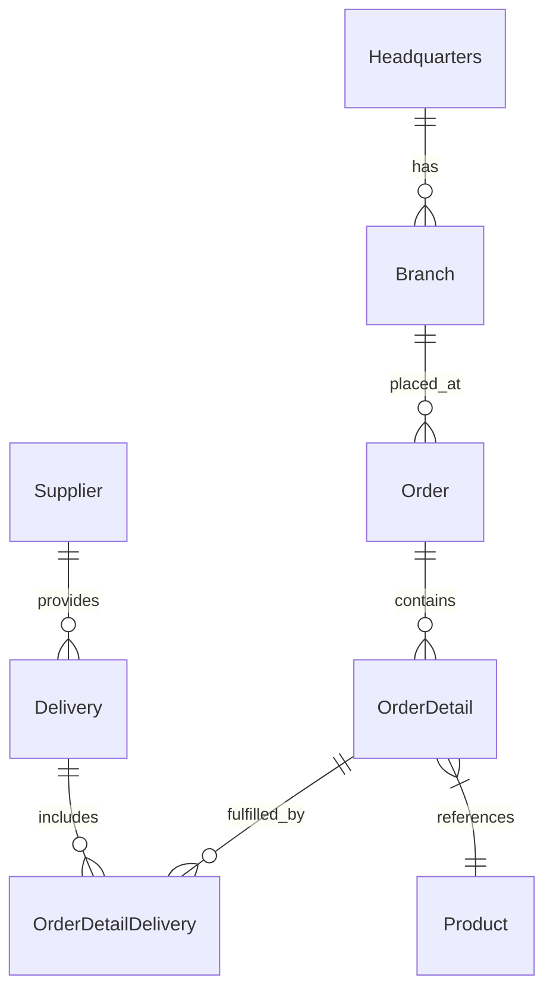
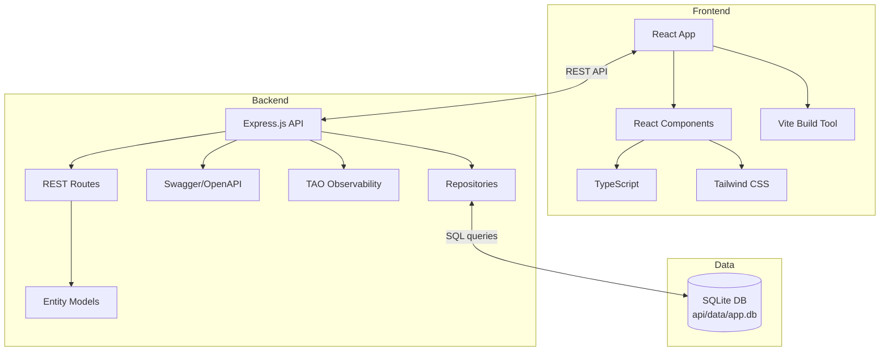

# OctoCAT Supply Chain Management System Architecture

This site is a demo application written in TypeScript. The entire app was created originally from an [ERD diagram](../api/ERD.png) and natural language prompts using Copilot. The frontend was created in the same way, using some of the design ideas in [the design folder](./design/).

The hero image and product images were created by prompting ChatGPT!

## Architecture Overview

The system is a modern supply chain management application built using TypeScript, comprising a backend REST API and a React frontend. It's designed to demonstrate Copilot capabilities using a fairly typical architecture with a little complexity, but not enough to derail demos!

### Backend Architecture
- Express.js API with RESTful endpoints for all entities
- SQLite persistence using a lightweight repository pattern
- Schema migrations and seed data managed via SQL files
- Swagger/OpenAPI documentation integration
- Entity models with proper relationships following an ERD diagram

### Frontend Architecture
- React 18+ with TypeScript
- Vite build tool for fast development
- Tailwind CSS for UI styling

### DevOps Integration
- Docker/Docker Compose for containerization
- Optional Bicep + GitHub Actions plan for Azure deployment

## ERD

## Component Architecture

## Key Features

- Complete REST APIs for all supply chain entities
- SQLite-backed persistence with foreign keys and indexed queries
- Declarative migrations (docs/sql/migrations) and deterministic seed data
- Detailed OpenAPI documentation, generated by Copilot
- Modern React UI with responsive design, generated by Copilot using images
- Containerization for consistent deployment, generated by Copilot
- **Product Comments & Feedback Feature**: User-generated comments with replies, reactions, and ownership tracking via browser tokens

### Product Comments Architecture

The comments feature provides a community feedback system distinct from product ratings:

**Data Model:**
- `product_comments` table: Stores user comments on products with optional author names
- `comment_replies` table: Single-level replies to comments with cascading deletes
- `comment_reactions` table: Helpful/not-helpful reactions with unique constraint per user-comment pair

**Ownership Model:**
- Browser-local UUID tokens stored in localStorage (`octocat.commentToken`)
- Tokens transmitted via `X-Comment-Token` HTTP header with all requests
- Server-side ownership verification before mutations (edit/delete)
- Supports anonymous comments (author_name is nullable)

**API Layer:**
- 11 REST endpoints covering comments, replies, and reactions
- Repository pattern with async/await database operations
- Full CRUD operations with proper error handling (ValidationError, NotFoundError, ConflictError)
- Swagger/OpenAPI documentation for all endpoints

**UI Components:**
- `ProductCommentsSection`: Root container with loading states
- `CommentCard`: Display with reactions and edit controls
- `RepliesSection`: Expandable replies with nested display
- `CreateCommentForm` & `CreateReplyForm`: Form inputs with validation
- `CommentsSkeleton`: Loading placeholder with animation
- Dark mode support via Tailwind CSS `dark:` classes
- Blue theme for comments (bg-blue-50/900), gray for replies (bg-gray-50/800)

See: [Product Comments Guide](./features/PRODUCT_COMMENTS_GUIDE.md)

## Persistence and Data Model

- Database: SQLite (file located at `api/data/app.db` by default; configurable via `DB_FILE`)

- Access: thin repository layer that maps camelCase models to snake_case columns

- Migrations: SQL scripts in `api/sql/migrations` executed in order and tracked in a `migrations` table
- Seeding: ordered SQL scripts in `api/sql/seed` to bootstrap demo data
- Test mode: in-memory database (`:memory:`) for fast and isolated tests

See the dedicated guide: `docs/sqlite-integration.md`.
